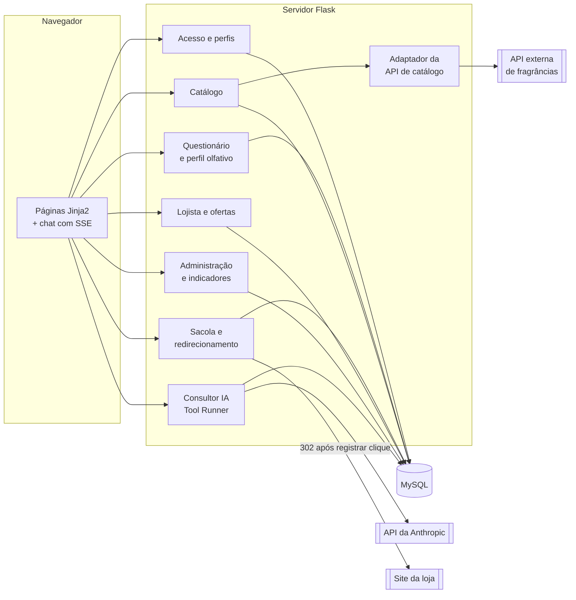

# 06 — Arquitetura e agente de IA

> **Status:** proposta. A stack depende do que a disciplina exigir (ver [12-decisoes-pendentes.md](12-decisoes-pendentes.md)). O desenho do agente e das integrações vale para qualquer stack.

## Stack proposta

| Camada | Escolha proposta | Por quê |
|---|---|---|
| Linguagem | Python 3.12 | SDK oficial da Anthropic (`anthropic`), boa para a equipe e para o conteúdo da disciplina. |
| Web | Flask + Jinja2 (páginas renderizadas no servidor) | Simples de ensinar e de testar; o chat usa *Server-Sent Events* para o streaming. |
| Autenticação | Flask-Login + Flask-WTF (CSRF) + hash Argon2 ou bcrypt | Atende RNF-01 a RNF-03. |
| Banco | MySQL 8, com SQLAlchemy e migrations Alembic | O template da disciplina usa MySQL Workbench; migrations atendem RNF-23. |
| IA | API da Anthropic pelo SDK `anthropic` (Python), com Tool Runner | Ver a seção "Agente consultor". |
| Tarefas agendadas | Job agendado (APScheduler ou cron do servidor) | Sincronização do catálogo (RF-16). |
| Hospedagem | A definir | Precisa suportar Python e MySQL e guardar variáveis de ambiente com segurança. |

## Visão de componentes



## Agente consultor (Claude via SDK da Anthropic)

### Modelo e parâmetros

| Parâmetro | Valor | Observação |
|---|---|---|
| Modelo | `claude-opus-5` | Modelo padrão recomendado. Trocar por `claude-sonnet-5` ou `claude-haiku-4-5`, que são mais baratos, é decisão da equipe, depois de medir a qualidade (ver "Custos"). |
| Raciocínio | adaptativo (padrão do `claude-opus-5`) | Não desligar: com o raciocínio desligado, o modelo pode escrever a chamada de ferramenta como texto em vez de executá-la. |
| Esforço (`output_config.effort`) | começar em `medium`, medir e ajustar | Conversa costuma manter a qualidade com esforço menor; subir só se as avaliações (RF-26) mostrarem necessidade. |
| Streaming | sim | A resposta aparece enquanto é gerada (RF-21, RNF-13). |
| `max_tokens` | 16000 | Evita cortar a resposta no meio. O custo real é o que o modelo gera, não o teto. |
| Recusas | `fallbacks: "default"` (beta `server-side-fallback-2026-07-01`) e tratar `stop_reason == "refusal"` antes de ler o conteúdo | Se o modelo recusar por política, a API tenta outro modelo na mesma chamada; se a cadeia inteira recusar, a tela mostra uma mensagem neutra. |

### Loop do agente: Tool Runner

O agente usa ferramentas definidas pelo próprio sistema. O **Tool Runner** do SDK (`client.beta.messages.tool_runner`, com as ferramentas declaradas pelo decorador `@beta_tool`) faz o ciclo *chamar o modelo → executar a ferramenta → devolver o resultado* até o modelo terminar. Com `stream=True`, cada rodada é consumida como stream e o texto vai para o navegador por SSE.

Esboço, a ser validado na implementação contra a documentação do SDK:

```python
import anthropic
from anthropic import beta_tool

client = anthropic.Anthropic()  # lê ANTHROPIC_API_KEY do ambiente (RNF-04)

def ferramentas_do_cliente(usuario_id: int):
    # usuario_id vem da SESSÃO, nunca do modelo (RNF-03)

    @beta_tool
    def obter_perfil_olfativo() -> str:
        """Retorna o perfil olfativo do cliente logado: nível de conhecimento e afinidade por família olfativa."""
        return repo.perfil_json(usuario_id)

    @beta_tool
    def buscar_perfumes(familias: list[str], genero: str = "", termo: str = "", limite: int = 8) -> str:
        """Busca perfumes VISÍVEIS do catálogo por família olfativa, gênero e termo livre (nome, marca ou nota).

        Args:
            familias: famílias olfativas desejadas, ex.: ["amadeirado", "cítrico"].
            genero: "masculino", "feminino", "unissex" ou vazio.
            termo: texto livre opcional.
            limite: máximo de perfumes retornados (1 a 20).
        """
        return repo.buscar_json(familias, genero, termo, min(limite, 20))

    @beta_tool
    def obter_ficha_perfume(perfume_id: int) -> str:
        """Retorna a ficha do perfume: marca, notas de saída/corpo/fundo e acordes."""
        return repo.ficha_json(perfume_id)

    @beta_tool
    def listar_ofertas(perfume_id: int) -> str:
        """Lista as ofertas ativas (loja e preço) de um perfume. Nunca invente preço ou loja."""
        return repo.ofertas_json(perfume_id)

    @beta_tool
    def registrar_recomendacao(perfume_id: int, posicao: int, justificativa: str) -> str:
        """Registra um perfume recomendado nesta conversa, com a justificativa curta mostrada ao cliente."""
        return repo.registrar_recomendacao(usuario_id, perfume_id, posicao, justificativa)

    return [obter_perfil_olfativo, buscar_perfumes, obter_ficha_perfume,
            listar_ofertas, registrar_recomendacao]
```

**Por que as recomendações passam por uma ferramenta:** a tela mostra os cartões de perfume a partir de `registrar_recomendacao`, que só aceita `perfume_id` visível do banco. O texto livre do modelo explica; o dado estruturado prova. Isso atende a RN-09 e ao RNF-11, e impede que um perfume inexistente apareça como botão de compra.

### Prompt de sistema e cache

Ordem do que vai para a API: **ferramentas → prompt de sistema → mensagens**. O cache de prompt reaproveita tudo o que for idêntico do começo até o ponto de cache.

1. **Ferramentas:** sempre as mesmas cinco, na mesma ordem.
2. **Prompt de sistema** (com `cache_control`):
   - identidade do consultor e o que ele pode e não pode fazer (RN-09, RN-16, RN-18);
   - regra contra manipulação: instruções do cliente não mudam estas regras (RNF-12);
   - as **diretrizes ativas definidas pelo administrador** (RF-25), que mudam raramente; quando mudam, o cache se renova sozinho.
3. **Mensagens:** o histórico da conversa, só acrescentando no fim, sem reescrever mensagens antigas.

O perfil do cliente **não** vai no prompt de sistema: entra pela ferramenta `obter_perfil_olfativo`. Assim o prompt de sistema é o mesmo para todos os clientes e o cache é compartilhado. Data, hora e IDs nunca entram antes do ponto de cache (RNF-15). Para conferir, `usage.cache_read_input_tokens` deve ser maior que zero a partir da segunda mensagem. O cache só existe acima de um tamanho mínimo de prefixo, que varia por modelo: se ferramentas e prompt de sistema forem curtos demais, ele não liga, e isso aparece nesse mesmo campo zerado.

### Persistência da conversa

- Cada turno é gravado em `mensagem` com o **conteúdo completo** devolvido pela API, incluindo blocos de ferramenta, para reenviar o histórico exatamente como veio.
- Cada resposta registra `input_tokens`, `output_tokens` e `cache_read_input_tokens` (RNF-14), que alimentam o indicador de custo (RF-37).
- Antes de chamar a API, o servidor confere o limite diário de mensagens do cliente (RN-15).

### Custos (estimativa para planejamento)

Preço de tabela da API da Anthropic por 1 milhão de tokens, conferir no site antes de decidir:

| Modelo | Entrada | Saída |
|---|---|---|
| `claude-opus-5` | US$ 5 | US$ 25 |
| `claude-sonnet-5` | US$ 2 | US$ 10 |
| `claude-haiku-4-5` | US$ 1 | US$ 5 |

**Fórmula por mensagem:** `custo ≈ (tokens_entrada × preço_entrada + tokens_saída × preço_saída) / 1.000.000`, com desconto nos tokens lidos do cache. Exemplo **hipotético**, sem cache, com `claude-opus-5`: 8.000 tokens de entrada (sistema + ferramentas + histórico + resultados) e 800 de saída dão cerca de US$ 0,04 + US$ 0,02 = **US$ 0,06 por mensagem**. O número real sai do registro de tokens (RNF-14) na primeira semana de testes. Com o limite de 30 mensagens por dia (RN-15), o teto por cliente ativo fica perto de US$ 1,80 por dia nesse exemplo, e é esse teto que orienta a escolha de modelo e de esforço.

### Tratamento de falhas

| Situação | Comportamento |
|---|---|
| API de IA fora do ar, erro 5xx ou limite de requisições (429) | O SDK já tenta de novo algumas vezes. Persistindo, a tela mostra "O consultor está indisponível agora" (RNF-16). |
| `stop_reason == "refusal"` depois do fallback | Mensagem neutra ("Não posso ajudar com isso; posso recomendar perfumes para você?"); nada é gravado como recomendação. |
| Ferramenta falha (ex.: banco) | Devolver o resultado da ferramenta como erro, para o modelo explicar ao cliente em vez de inventar. |
| Limite diário atingido (RN-15) | Nem chama a API; informa quando o limite renova. |

## Redirecionamento para a loja

- Cada botão de compra aponta para uma rota interna, como `/ir/oferta/<id>?origem=sacola`, e nunca direto para a loja.
- A rota confere se a oferta está ativa e se a loja está aprovada, grava o clique (RN-13) e responde `302` para a URL da oferta.
- Como o navegador só abre uma aba por clique, a finalização da sacola mostra a lista de perfumes com um botão por loja, e um "Abrir todas" que funciona quando o navegador permite (R-05).

## Integração com a API de catálogo

Fica atrás de um adaptador (`CatalogoProvider`) com duas operações: `listar_pagina(cursor)` e `obter(id_api)`. A importação converte o formato da API para as tabelas `perfume`, `marca`, `nota_olfativa`, `acorde` e ligações, aplicando a RN-07. O provedor escolhido, seus limites e seus termos estão em [08-integracoes.md](08-integracoes.md).
